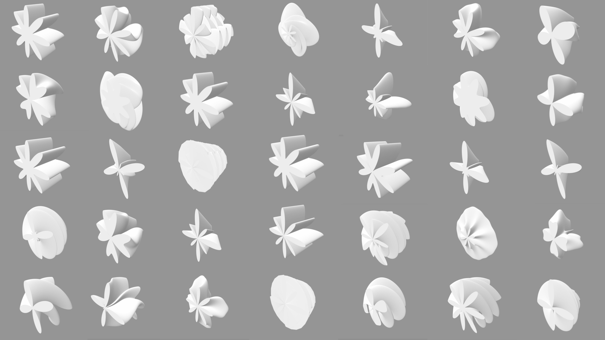

<h1 align="center">
  
</h1>

| [Explore the Docs 📚](https://github.com/samsilverman/gcs/wiki) | [Read the Paper 📖](https://github.com/samsilverman/gcs/) | [Report a Bug 🐛](https://github.com/samsilverman/gcs/issues) | [Request a Feature 💻](https://github.com/samsilverman/gcs/issues) |
|--------------------|-------------|--------------|-------------------|

`gcs` is a Python library for creating generalized cylindrical shells (GCS).



GCS are parameterized by 11 values:

| Syntax | Description | Units |
| - | - | - |
| `c1_base` | The base $4$-lobe parameter. | - |
| `c2_base` | The base $8$-lobe parameter. | - |
| `c1_top` | The top $4$-lobe parameter. | -
| `c2_top` | The top $8$-lobe parameter. | - |
| `twist_linear` | The linear twist. | - |
| `twist_amplitude` | The oscillating twist amplitude. | - |
| `twist_period` | The oscillating twist period. | - |
| `angle` | The angle from the top to base. | degrees |
| `height` | The height. | mm |
| `mass` | The mass. | g |
| `thickness` | The wall thickness. | mm |

**Note**: Visit the [documentation](https://github.com/samsilverman/gcs/wiki) for detailed descriptions and visualizations of each parameter.

## Getting Started

These instructions will get you a copy of ``gcs`` up and running on your local machine.

## Installation

```bash
pip install gcs
```

### Requirements

* [bentley-ottmann](https://pypi.org/project/bentley-ottmann/) (version: 7.3.0)
* [numpy](https://pypi.org/project/numpy/) (version: 1.21.5 or higher)
* [numpy-stl](https://pypi.org/project/numpy-stl/) (version: 2.17.1 or higher)
* [pandas](https://pypi.org/project/pandas/) (version: 1.4.1 or higher)
* [scipy](https://pypi.org/project/scipy/) (version: 1.7.3 or higher)

## Contributing

1. Fork the project.

2. Create your feature branch:

    ```bash
    git checkout -b feature/NewFeature
    ```

3. Commit your changes:

    ```bash
    git commit -m 'Add a new feature.'
    ```

4. Run the unit tests:

    ```bash
    python -m pytest
    ```

5. Push to the branch:

    ```bash
    git push origin feature/NewFeature
    ```

6. Open a pull request.

## Contact

Maintainers:

* [Sam Silverman](https://github.com/samsilverman/) - [sssilver@bu.edu](mailto:sssilver@bu.edu)

## Acknowledgements

* [Best README Template](https://github.com/othneildrew/Best-README-Template)

### Original Contributors

* [Sam Silverman](https://github.com/samsilverman/) - [sssilver@bu.edu](mailto:sssilver@bu.edu)
* [Kelsey Snapp](https://github.com/KelseyEng/) - [ksnapp@bu.edu](mailto:ksnapp@bu.edu)
* [Benjamin Verdier](https://github.com/BenjaminVerdier)
