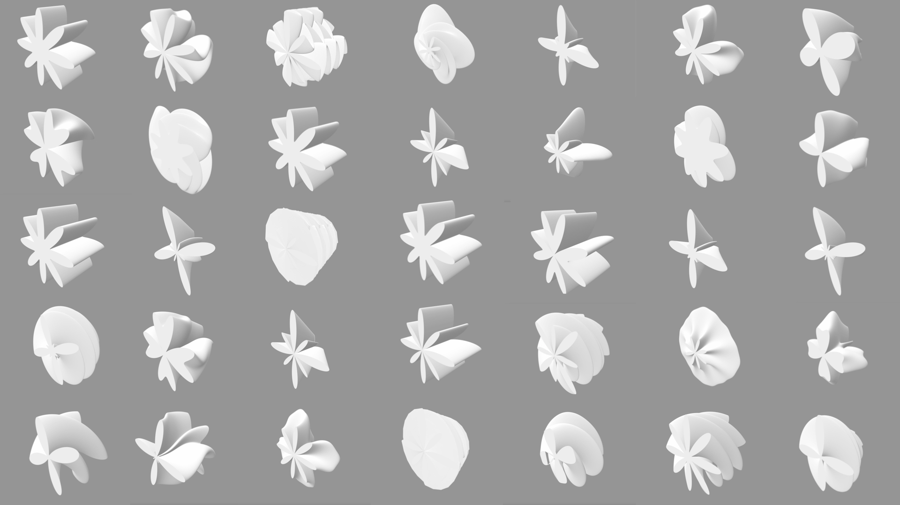

# GCS # TODO: UPDATE



Simple library for creating continuous line structures (GCS). The library provides

1. An object representing a continuous line structure.

2. Operations on GCS structures.

## Getting Started

These instructions will get you a copy of ``gcs`` up and running on your local machine.

### Prerequisites

You will need to install the following software:

* [Conda](https://docs.conda.io/en/latest/)

### Installation

1. Clone the repository.

    ```bash
    git clone https://github.com/samsilverman/gcs.git
    ```

2. Create the conda environment.

    ```bash
    conda env create --file /path/to/gcs/gcs.yml
    ```

    **NOTE**: To use an existing conda environment instead of the ``gcs`` conda environment, run:

    ```bash
    conda env update --name [env_name] --file /path/to/gcs/gcs.yml --prune
    ```

    For step 3, use the existing conda environment.

3. Activate the conda environment.

    ```bash
    conda activate gcs
    ```

    **NOTE**: To deactivate the environment, run:

    ```bash
    conda deactivate gcs
    ```

4. Locally install ``gcs`` with pip:

    ```bash
    pip install /path/to/gcs/
    ```

## Usage

Documentation is available in docstrings provided with the code.

The docstring examples assume that ``gcs`` has been imported:

```python
>>> import gcs
```

The following are available subpackages within ``gcs``

* ``io``
  * Functions for loading/saving GCS shapes.

* ``verify``
  * Functions for verifying the validity of GCS shapes.

* ``random``
  * Functions for generating random GCS shapes.

## Testing

To test, run

```bash
python -m pytest
```

## Contact

Maintainers:

* Sam Silverman - [@sam_silverman](https://twitter.com/sam_silverman) - [sssilver@bu.edu](mailto:sssilver@bu.edu)
